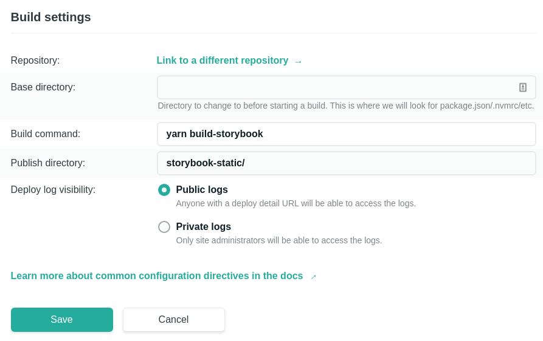

<h1 align="center">

<a href="https://gatsby-tailwind-styled-components-storybook-starter.netlify.com/">

</a>


</h1>

## 💄 Demo

- [Site](https://gatsby-tailwind-styled-components-storybook-starter.netlify.com/)
- [Storybook](https://storybook-gatsby-tailwind-styled-starter.netlify.com/)

## ✨ Motivation

- Use [Tailwind CSS v1](https://tailwindcss.com/) in [Styled-Components](https://www.styled-components.com/).
- Decouple developing with [Storybook](https://storybook.js.org/).
- Use [PostCSS](https://postcss.org/) to extend Tailwind's CSS.
- Enabling [Postcss-Preset-Env](https://preset-env.cssdb.org/) out-of-the box.

```jsx
// More Tailwind examples https://tailwindcss.com/components/

import tw from 'tailwind.macro';

// Standalone Tailwind Classes
const Main = tw.div`
  p-6 bg-gray-100 rounded-lg shadow-2xl
`;

// Keep the power of styled-components
const Wrapper = styled.div`
  ${tw`flex items-center justify-center flex-col h-screen`}
  color: ${({ isClicked }) => (isClicked ? 'red' : 'blue')}
`;

// Develop and test with storybook v5
import React from 'react';
import IndexPage from './IndexPage.react';

export default {
  title: 'IndexPage',
};

export const Default = () => <IndexPage />;
```

> 📦 What's this template solves?
>
> - Configure Tailwind to work with CSS-in-JS & PostCSS.
> - Configure Gatsby & Tailwind to work with Storybook.
> - Usage Examples (`IndexPage` component).
> - Deploy ready, either for Storybook.

## 🚀 Quick start

1. Get the repo with Gatsby CLI **or** clone from Github

   ```sh
   # Create a new Gatsby site using the gatsby CLI
   gatsby new my-tailwind-styled-starter https://github.com/denvash/gatsby-tailwind-styled-components-storybook-starter
   cd my-tailwind-styled-starter/
   ```

   ```sh
   # Clone the repo
   git clone https://github.com/denvash/gatsby-tailwind-styled-components-storybook-starter.git
   cd gatsby-styled-tailwind-storybook-starter
   yarn install
   ```

2. Start Develop

   ```sh
   yarn develop
   yarn storybook
   ```

   > You must run develop once before storybook.
   >
   > Storybook must have access to `public` folder.

## 📕 Deploying Storybook to Netlify

Edit the **Build Command** and the **Publish directory** at **Build & Deploy** section.

```sh
yarn build-storybook
storybook-static/
```



## 🧐 What's inside?

A quick look at the top-level files and directories you'll see in a Gatsby project.

```sh
./
  ├── gatsby-browser.js
  ├── gatsby-config.js
  ├── gatsby-node.js
  ├── gatsby-ssr.js
  ├── jsconfig.json
  ├── LICENSE
  ├── node_modules
  ├── package.json
  ├── postcss.config.js
  ├── README.md
  ├── src
  ├── static
  ├── tailwind.config.js
  └── yarn.lock
```

1. **`/node_modules`**: This directory contains all of the modules of code that your project depends on (npm packages) are automatically installed.

2. **`/src`**: This directory will contain all of the code related to what you will see on the front-end of your site (what you see in the browser) such as your site header or a page template. `src` is a convention for “source code”.

3. **`.babelrc`**: This configuration file allows us to fine-tune [Babel's configuration settings](https://babeljs.io/docs/en/configuration). In this starter we are adding the [`babel-preset-gatsby`](https://github.com/gatsbyjs/gatsby/tree/master/packages/babel-preset-gatsby) preset to allow us to customize Babel as needed.

4. **`.gitignore`**: This file tells git which files it should not track / not maintain a version history for.

5. **`.prettierignore`**: This file allows us to specifiy files that we want to exclude from formatting with Prettier.

6. **`.prettierrc`**: This is a configuration file for [Prettier](https://prettier.io/). Prettier is a tool to help keep the formatting of your code consistent.

7. **`gatsby-browser.js`**: This file is where Gatsby expects to find any usage of the [Gatsby browser APIs](https://www.gatsbyjs.org/docs/browser-apis/) (if any). These allow customization/extension of default Gatsby settings affecting the browser. By default we are injecting Tailwind's [base styles](https://tailwindcss.com/docs/adding-base-styles/#app) into the browser.

8. **`gatsby-config.js`**: This is the main configuration file for a Gatsby site. This is where you can specify information about your site (metadata) like the site title and description, which Gatsby plugins you’d like to include, etc. (Check out the [config docs](https://www.gatsbyjs.org/docs/gatsby-config/) for more detail).

9. **`gatsby-node.js`**: This file is where Gatsby expects to find any usage of the [Gatsby Node APIs](https://www.gatsbyjs.org/docs/node-apis/) (if any). These allow customization/extension of default Gatsby settings affecting pieces of the site build process.

10. **`gatsby-ssr.js`**: This file is where Gatsby expects to find any usage of the [Gatsby server-side rendering APIs](https://www.gatsbyjs.org/docs/ssr-apis/) (if any). These allow customization of default Gatsby settings affecting server-side rendering.

11. **`LICENSE`**: Gatsby is licensed under the MIT license.

12. **`package-lock.json`**: (See `package.json` below, first). This is an automatically generated file based on the exact versions of your npm dependencies that were installed for your project. **(You won’t change this file directly).**

13. **`package.json`**: A manifest file for Node.js projects, which includes things like metadata (the project’s name, author, etc). This manifest is how npm knows which packages to install for your project.

14. **`postcss.config.js`**: This configuration file allows us to customize our [PostCSS](https://postcss.org/) settings. PostCSS is used to compile the custom css we write outside of `styled-components`.

15. **`README.md`**: A text file containing useful reference information about your project.

16. **`tailwind.config.js`**: This is the default [Tailwind CSS configuration](https://tailwindcss.com/docs/configuration/) file.

## 💫 Deploy Now

[](https://app.netlify.com/start/deploy?repository=https://github.com/denvash/gatsby-tailwind-styled-components-storybook-starter)
